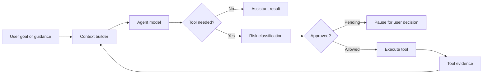
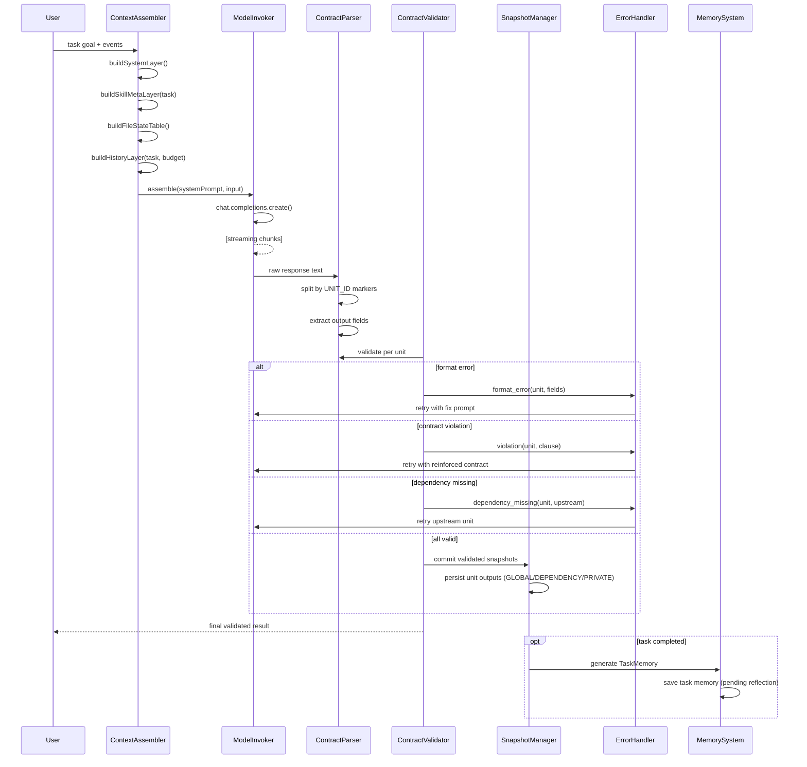

# Architecture Notes

> 完整文档导航见 [README.md](README.md)（实现标准总目录）。

The preserved design files are treated as source material:

- `docs/DigDeeper.md` contributes simple composition, transparent execution, tool contracts, and minimal context.
- `docs/experience.md` contributes progressive disclosure, model autonomy under guardrails, risk-based approvals, traceability, and experience-to-skill growth.

## Runtime Flow

## Component Interaction (Full Task Lifecycle)

## Safety Boundary

The system never blocks a task because it failed a fixed task script. It only pauses for real operational risk: host observation, workspace read, workspace write, shell, network, or destructive actions.

## Learning Boundary

Completed tasks generate experience records. Read-only records can become enabled skills automatically. Records involving side effects remain drafts until reviewed.
