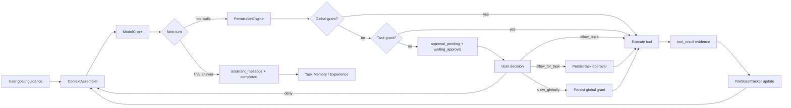

# Agent Workbench Architecture

> 完整文档导航见 [README.md](README.md)。
>
> 本文以当前代码为准。`DigDeeper.md` 是愿景和研究约束，不是已交付清单；当文档和实现冲突时，优先相信源码、测试和真实任务行为。

## Current Product Boundary

Agent Workbench 当前实现的是本地 Agent Workbench，而不是脚本门禁系统，也不是完整的多平台 Agent 云。系统职责收敛为：

- 组装上下文，让模型看到必要目标、历史、工具证据、文件状态和相关 skill metadata。
- 暴露工具，并按风险类别做审批。
- 记录事件流，形成用户可见 timeline。
- 在任务完成后生成 Task Memory、Pattern、Skill 方向的数据。
- 提供前端工作台、权限面板、学习面板和轻量任务线程。

系统不做这些事：

- 不用 scenario pack、quality gate、固定 JSON、固定报告模板判断普通任务是否完成。
- 不把工程测试或脚本输出当作任务完成判官。
- 不声称当前已完成 Python SDK、OpenTelemetry 全量兼容、多消息平台网关或 A2A agent-to-agent adapter。MCP 当前覆盖已配置的 stdio 与 streamable HTTP 工具发现/调用，不等同于完整远程 auth、资源模板平台或 Agent2Agent 互操作端点。

## Runtime Loop And Loop Engineering

Loop Engineering is the runtime discipline behind Agent Workbench: observe current state, plan the smallest responsible path, act through approved tools, verify with evidence, reflect into learning records, then persist or stop with a clear result. It is intentionally not a rigid script and must not turn ordinary tasks into fixed-output benchmark prompts.

Cache-aware loop constraints:

- Stable system instructions, skill metadata, project memory, and tool-name families should remain early in the prompt to improve provider-side prompt-cache reuse.
- Task-specific evidence, recent messages, file excerpts, screenshots, and tool results should stay later in context so they can change without fragmenting the stable prefix more than necessary.
- Prompt-cache optimization must not remove full tool schemas, hide current evidence, skip verification, or downgrade model capability. The target is a rolling cached-token hit ratio of at least 90% for cache-capable providers after warmup while preserving task quality.
- Token/cache usage is recorded as task telemetry and prompt-cache stats; it is not injected back into model context as task evidence.

## Main Components

| Component | Current implementation | Notes |
| --- | --- | --- |
| HTTP API | `apps/server/src/server.ts` | Fastify routes for tasks, messages, approvals, global permissions, preferences, memories, patterns, skills, reflections, project memories. |
| Persistence | `apps/server/src/sqlite-store.ts` | SQLite key-value namespaces. Good enough for local workbench; not yet a relational query model. |
| Runtime | `packages/core/src/workbench.ts` | Simple model/tool/approval/evidence loop. This is the product source of truth. |
| Context | `packages/core/src/context-assembler.ts` | System layer, loaded skills, skill metadata, project memory, file state table, truncated history. |
| Permissions | `packages/core/src/permission-engine.ts` | Risk-category classifier plus task/global grants. Deterministic safety boundary, not task-quality logic. |
| Tools | `packages/core/src/tools.ts`, `packages/core/src/mcp.ts` | Built-in tools plus configured MCP tools. File writes require `expectedHash`; MCP calls use the same evidence and approval path. |
| Model | `packages/core/src/openai-model.ts` | OpenAI-compatible chat completions and function tools. Uses API key document or env vars. |
| Learning | `packages/core/src/experience.ts` | Task Memory, Experience, Pattern, Skill promotion heuristics. Early-stage and intentionally conservative. |

## Permissions

Approval order is fixed:

1. Global risk-category grant.
2. MCP approval preference for MCP tools.
3. General auto-approval preference for non-MCP tools.
4. Existing task-scoped approval grant.
5. Pending approval UI.
6. Denied result goes back into context for the agent to choose another path.

Risk categories are:

- `host_observation`
- `workspace_read`
- `workspace_write`
- `shell`
- `network`
- `destructive`

Global grants are persisted. Task-scoped grants are stored on the task approval record and rehydrated by the runtime. Preference-based auto approval never bypasses `destructive`; only an explicit global grant can do that.

## Context Assembly

The current ContextAssembler emits:

1. System instructions.
2. Previously loaded full skill bodies.
3. Relevant skill metadata.
4. Project memory.
5. File state table.
6. Recent task history and current input.

Task Memory is never directly injected. Skill metadata may be injected; full skill content is loaded only through `use_skill`.

## Learning Boundary

Learning is advisory. A skill is a reusable hint, not a hidden policy engine and not a completion judge.

Current behavior:

- Every completed task creates Task Memory and Experience.
- Read-only successful experiences can become active skills.
- Side-effect experiences remain candidate skills.
- Reflection can aggregate memories into patterns and promote stable patterns.

Known limitations:

- Skill conflict handling is mostly design-level, not a complete product workflow.
- Skill success/failure stats are not yet updated from future real use.
- Reflection is heuristic and local; it is not yet a robust review-agent process.

## MCP Boundary

Current implementation discovers configured MCP servers over stdio or streamable HTTP, converts `tools/list` schemas into model tool definitions, routes `tools/call` through risk approval, and records results as normal `tool_result` evidence.

Still partial: resource templates, remote auth negotiation, marketplace-style discovery, and broader server lifecycle management are not product-complete.

## Agent Protocol Boundary

MCP and A2A solve different interoperability problems:

| Protocol | Boundary | Current Agent Workbench status |
| --- | --- | --- |
| MCP | Agent-to-tool and agent-to-context connection | Implemented for configured stdio and streamable HTTP tool discovery/calls, with existing approval and evidence handling |
| A2A / Agent2Agent | Agent-to-agent discovery, delegation, status, message, and artifact exchange | Ecosystem-aligned only; no shipped A2A server or full A2A client is claimed |
| AGENTS.md | Repository-local operating instructions for coding agents | Accepted as project guidance, not treated as a network protocol |

Current external facts checked for this boundary:

- Google announced A2A on 2025-04-09 as an open protocol for agent interoperability.
- Google later transferred A2A specification, SDKs, and tooling to the Linux Foundation Agent2Agent project, with participants including AWS, Cisco, Google, Microsoft, Salesforce, SAP, and ServiceNow.
- Microsoft publicly announced A2A support plans for Azure AI Foundry and Copilot Studio and documents A2A endpoint connection flows in Foundry Agent Service.

A future A2A adapter would need Agent Card discovery, authenticated task lifecycle mapping, message/artifact mapping, approval mapping, audit logs, and timeline evidence. Until those exist in code and tests, docs should say "aligned with A2A" rather than "supports A2A".

## Validation

Allowed validation:

- Typecheck.
- Unit/integration tests.
- Build.
- E2E/smoke tests.
- Real task execution and user review.

Disallowed validation:

- Scripts that decide ordinary task quality.
- Prompt injection that forces fixed JSON, report files, quality evidence files, or scenario-specific reports.
- Hidden hardcoded task paths that make one benchmark pass while reducing generality.

Scripts can exist as engineering tests or optional tools. They do not control agent completion.
