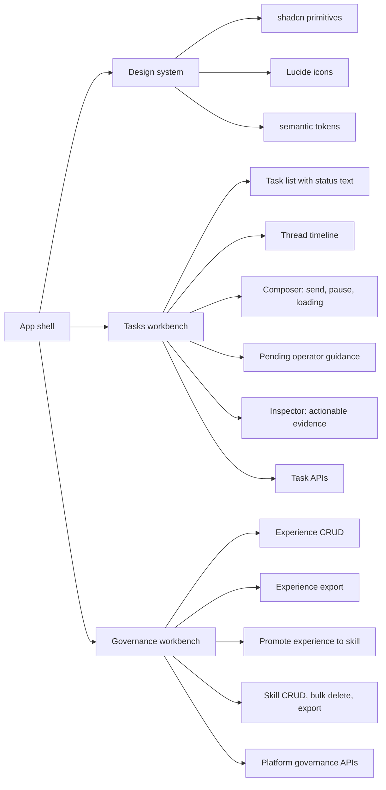
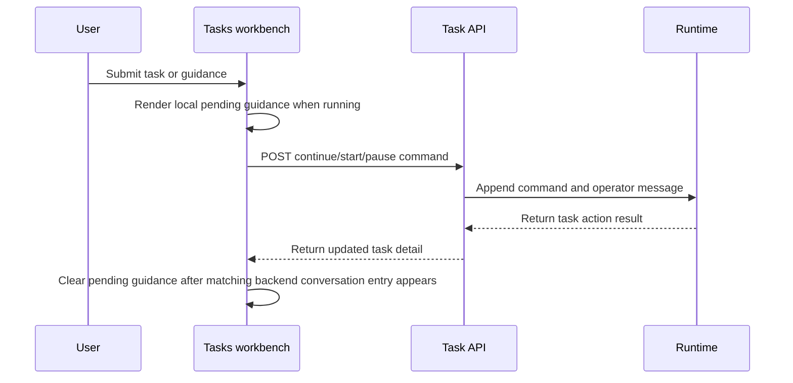

# SCC Frontend Refactor Plan

Date: 2026-05-03

This plan records the frontend flagship refactor decisions currently implemented in the repository. The goal is a quiet product workbench, not a validation-script-shaped UI.

## Principles

- Keep the runtime truth in backend task state and API responses.
- Keep the frontend state model explicit, small, and user-facing.
- Prefer shadcn-style primitives, Lucide icons, semantic tokens, and compact layouts.
- Keep task status text in lists, but remove duplicated badge/dot noise from the discussion surface.
- Preserve diagnostic backend capabilities when removing them from user-facing discussion UI.
- Make operator guidance a first-class running-task interaction. A submitted guidance message is shown as pending until the backend conversation includes it.

## Architecture

## Task Submission And Continuation Flow

## Milestones

1. Baseline and contract lock
   - Record current script drift and route ownership.
   - Confirm `TasksPage` is the active TaskDiscussion surface.

2. Design system reset
   - Fix `components.json` Tailwind entry.
   - Add shared primitives for input, textarea, checkbox, table, tabs, separator, spinner.
   - Normalize oversized radii in high-traffic components.

3. Task workbench refactor
   - Remove restart from discussion UI and frontend validation selectors.
   - Replace send text button with circular up-arrow icon button.
   - Add square pause button and spinner loading state.
   - Keep status text in list only.
   - Add running-task guidance and pending guidance display.

4. Governance workbench
   - Add experience CRUD, export, bulk delete, and promote-to-skill flow.
   - Add skill bulk delete and export.
   - Surface both in Settings > Governance.

5. Cleanup, docs, and validation
   - Remove source-tree patch artifacts.
   - Add unit/integration test coverage for new governance and task action contracts.
   - Run typecheck, build, unit tests, and frontend script drift checks.

## Success Criteria

- No frontend source or validation script expects `task-action-restart`.
- Restart backend/client capability remains available for non-discussion diagnostic compatibility.
- Running tasks accept user guidance without forcing a pause/restart interaction.
- Guidance appears immediately as pending before the backend conversation confirms it.
- Governance users can create, edit, delete, bulk delete, export, and promote experience records.
- Governance users can export and bulk delete skills.
- Frontend typecheck and build pass.
